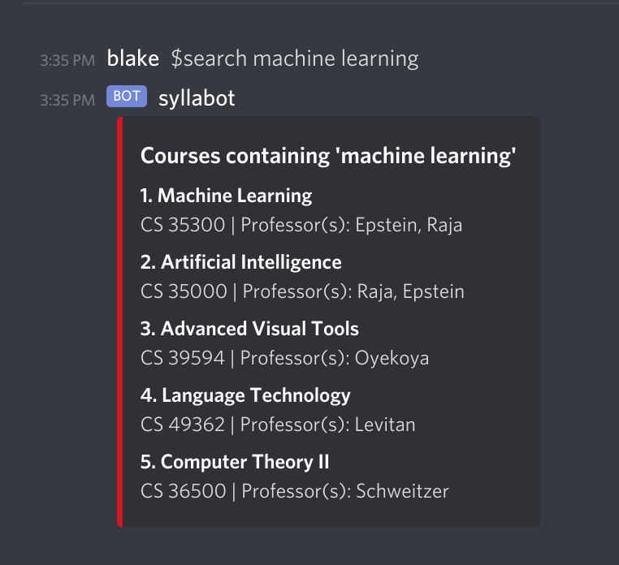

# syllabase

Syllabase is a search engine for college class syllabi. The project contains a crawler, a web frontend, and a Discord bot (syllabot). It is currently in an Alpha state. If you're interested in contributing, please join our [Discord Server](https://www.huntercs.club/contact).

Check out our issues and out project board.

### Contributors: 

- [@rvente](https://github.com/rvente), Vente, Blake
- [@boubascript](https://github.com/boubascript)
- [@xuejingao](https://github.com/xuejingao), Gao, Xuejin

